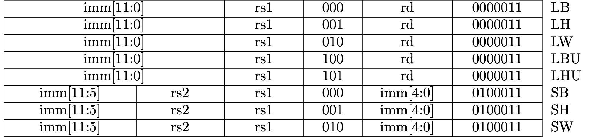

# Memory and System Bus

This is a part of the [Writing a RISC-V Emulator in Rust](../). Our goal is
running [xv6](https://github.com/mit-pdos/xv6-riscv), a small Unix-like OS, in
your emulator in the final step.

The source code used in this page is available at
[d0iasm/rvemu-for-book/02/](https://github.com/d0iasm/rvemu-for-book/tree/master/02).

## The Goal of This Page

In this page, we will implement a memory (DRAM) and a system bus. The memory is
used to store and load data. The system bus is a pathway to carry data between
the CPU and the memory.

These components enable to execute load and store instructions which are the
part of base integer instruction set. There are 7 load instructions (`lb`, `lh`,
`lw`, `ld`, `lbu`, `lhu`, and `lwu`) and 4 store instructions (`sb`, `sh`, `sw`,
and `sd`).

## Define Modules

Rust has a powerful module system that can split code into logical units. Each
unit is called a module.

First, we divide `main.rs` implemented in the previous section. The code of the
CPU is splited to a new file `cpu.rs`.

To define a CPU module, we need to `mod` keyword at the beginning of the
`main.rs` file. The `use` keyword allows us to use public items defined in the
CPU module.

<p class="filename">main.rs</p>

```rust
// This declaration will look for a file named `cpu.rs` or `cpu/mod.rs` and
// will insert its contents inside a module named `cpu` under this scope.
mod cpu;

// Use all public structures, methods, and functions defined in the cpu module.
use crate::cpu::*;
```

<p class="filename">cpu.rs</p>

```rust
// `pub` keyword allows other modules use the `Cpu` structure and methods
// relating to it.
pub struct Cpu {
    ...
}

impl Cpu {
    ...
}
```

## Memory (DRAM)

The memory we going to implement is a dynamic random-access memory which is
called DRAM. It is used to store/load data while the program is running.

We represent it as a `Dram` struct. It contains a vector of bytes as a member.

The vector of bytes in the `Dram` instance is initialized with the data
containing executable binary when it's created by `Dram::new()`.

<p class="filename">dram.rs</p>

```rust
pub const MEMORY_SIZE: u64 = 1024 * 1024 * 128; // 128MiB

pub struct Dram {
    pub dram: Vec<u8>,
}

impl Dram {
    pub fn new(code: Vec<u8>) -> Dram {
        let mut dram = vec![0; MEMORY_SIZE as usize];
        dram.splice(..code.len(), code.iter().cloned());

        Self { dram }
    }
}
```

### Load and Store Methods

There are `load` and `store` public methods for the `Dram` struct. Arguments in
each method are an address and the number of bytes. The number of bytes can be
8, 16, 32, and 64 bytes.

<p class="filename">dram.rs</p>

```rust
impl Dram {
    ...
    pub fn load(&self, addr: u64, size: u64) -> Result<u64, ()> {
        match size {
            8 => Ok(self.load8(addr)),
            16 => Ok(self.load16(addr)),
            32 => Ok(self.load32(addr)),
            64 => Ok(self.load64(addr)),
            _ => Err(()),
        }
    }

    pub fn store(&mut self, addr: u64, size: u64, value: u64) -> Result<(), ()> {
        match size {
            8 => Ok(self.store8(addr, value)),
            16 => Ok(self.store16(addr, value)),
            32 => Ok(self.store32(addr, value)),
            64 => Ok(self.store64(addr, value)),
            _ => Err(()),
        }
    }
    ...
}
```

`load8`, `load16`, `load32`, and `load64` (`store*` as well) are private
methods to help us operate the DRAM with the specific size of bytes. The DRAM
is a little-endian system as described in the previous section so we need to be
careful the order of bytes.

The following code is `load32` and `store32`. The byte of a smallest memory
address (`index`) is stored at the least signigicant byte at the largest and
the byte of a largest memory address (`index + 3`) is stored at the most
significant byte of a word.

<p class="filename">dram.rs</p>

```rust
impl Dram {
    ...

    fn load32(&self, addr: u64) -> u64 {
        let index = (addr - MEMORY_BASE) as usize;
        return (self.dram[index] as u64)
            | ((self.dram[index + 1] as u64) << 8)
            | ((self.dram[index + 2] as u64) << 16)
            | ((self.dram[index + 3] as u64) << 24);
    }

    fn store32(&mut self, addr: u64, value: u64) {
        let index = (addr - MEMORY_BASE) as usize;
        self.dram[index] = (value & 0xff) as u8;
        self.dram[index + 1] = ((value >> 8) & 0xff) as u8;
        self.dram[index + 2] = ((value >> 16) & 0xff) as u8;
        self.dram[index + 3] = ((value >> 24) & 0xff) as u8;
    }
    ...
}
```

### Add Dram to Module

Let's add the `Dram` as a module. Once adding one line at `main.rs`, `dram.rs`
can be included to the build target by `cargo build` and we can use methods
defined at `dram.rs`.

<p class="filename">main.rs</p>

```rust
mod dram;
```

From now on, we will add a new file as a module implicitly when it is added.

## System Bus

A system bus is a component to carry data between the CPU and peripheral devices
such as a DRAM. In actual hardware, there are 3 types of a bus. The 3 buses together are called a system bus.

- Address bus: carries memory addresses.
- Data bus: carries the data.
- Control bus: carries control signals.

Our implementation doesn't care the differences between them and a system bus
just connects the DRAM (and other peripheral devices) to the CPU and carries
memory addresses and data stored in the memory and between them.

The `Bus` struct has a `dram` member and other peripheral devices we will add
later. The `Cpu` struct now has a `bus` member in it instead of a `dram`
member so that the CPU can access the DRAM via a system bus.

<p class="filename">bus.rs</p>

```rust
pub struct Bus {
    dram: Dram,
}
```

<p class="filename">cpu.rs</p>

```rust
pub struct Cpu {
    pub regs: [u64; 32],
    pub pc: u64,
    pub bus: Bus,
}
```

### Memory-mapped I/O

Memory-mapped I/O (MMIO) is a method performing input and output between the
CPU and peripheral devices. MMIO uses the same address space as both DRAM and
peripheral devices. It means you can use same `load` and `store` instructions
for accessing peripheral devices. When you access at a memory address, it can
connect to either a DRAM or a specific peripheral device via the system bus.

The system bus is responsible for a memory map in our implementation. A memory
map is a structure of data which indicates how memory is laid out for a DRAM
and peripheral devices. This can be different depending on a hardware system.

For example, [virt machine in
QEMU](https://github.com/qemu/qemu/blob/master/hw/riscv/virt.c) has the
following memory map. In the virt machine, DRAM starts at 0x80000000. We're
going to implement the same memory map as the map of a virt machine although we
only have a part of the peripheral devices the virt machine has.

```c
static const struct MemmapEntry {
    hwaddr base;
    hwaddr size;
} virt_memmap[] = {
    [VIRT_DEBUG] =       {        0x0,         0x100 },
    [VIRT_MROM] =        {     0x1000,        0xf000 },
    [VIRT_TEST] =        {   0x100000,        0x1000 },
    [VIRT_RTC] =         {   0x101000,        0x1000 },
    [VIRT_CLINT] =       {  0x2000000,       0x10000 },
    [VIRT_PCIE_PIO] =    {  0x3000000,       0x10000 },
    [VIRT_PLIC] =        {  0xc000000, VIRT_PLIC_SIZE(VIRT_CPUS_MAX * 2) },
    [VIRT_UART0] =       { 0x10000000,         0x100 },
    [VIRT_VIRTIO] =      { 0x10001000,        0x1000 },
    [VIRT_FLASH] =       { 0x20000000,     0x4000000 },
    [VIRT_PCIE_ECAM] =   { 0x30000000,    0x10000000 },
    [VIRT_PCIE_MMIO] =   { 0x40000000,    0x40000000 },
    [VIRT_DRAM] =        { 0x80000000,           0x0 },
};
```

There are `load` and `store` public methods for the `Bus` struct. Arguments in
each method are an address and the number of bytes. The number of bytes can be
8, 16, 32, and 64 bytes.

If the `addr` is larger than 0x80000000, we can access to the DRAM.

<p class="filename">dram.rs</p>

```rust
impl Bus {
    ...

    pub fn load(&self, addr: u64, size: u64) -> Result<u64, ()> {
        if MEMORY_BASE <= addr {
            return self.dram.load(addr, size);
        }
        Err(())
    }

    pub fn store(&mut self, addr: u64, size: u64, value: u64) -> Result<(), ()> {
        if MEMORY_BASE <= addr {
            return self.dram.store(addr, size, value);
        }
        Err(())
    }
}
```

## Update the CPU

We're going to implement load and store instructions which are the part of base
integer instruction set. There are 7 load instructions, `lb`, `lh`, `lw`, `lbu`, and `lhu` defined at RV32I and `lwu` and `ld` defined at RV64I. There are 4 store instructions, `sb`, `sh`, and `sw` defined at RV32I and `sd` defined at RV64I.

### Fetch-decode-execute Cycle

We update the fetch-decode-execute cycle introduced in the previous page. The
emulator continues to execute the cycle until `fetch` or `execute` methods fail.

<p class="filename">main.rs</p>

```rust
fn main() -> io::Result<()> {
    ...
    loop {
        // 1. Fetch.
        let inst = match cpu.fetch() {
            // Break the loop if an error occurs.
            Ok(inst) => inst,
            Err(_) => break,
        };

        // 2. Add 4 to the program counter.
        cpu.pc += 4;

        // 3. Decode.
        // 4. Execute.
        match cpu.execute(inst) {
            // Break the loop if an error occurs.
            Ok(_) => {}
            Err(_) => break,
        }

        // This is a workaround for avoiding an infinite loop.
        if cpu.pc == 0 {
            break;
        }
    }
    ...
}
```

### Fetch Stage

The next executable binary can be fetched from DRAM via the system bus we just
created. The size of bytes is 32 since the the length of one instruction in
RISC-V is always 4 bytes. (Note: The length of one instruction can be 2 bytes in
the compressed instruction set.)

<p class="filename">cpu.rs</p>

```rust
impl Cpu {
    ...  
    pub fn fetch(&mut self) -> Result<u64, ()> {
        match self.bus.load(self.pc, 32) {
            Ok(inst) => Ok(inst),
            Err(_e) => Err(()),
        }
    }
    ...
}
```

### Decode Stage

Load instructions are I-type and store instrucrtions are S-type format as we can
see them in Fig 2.1. and 2.2. The positions for `rs1`, `funct3` (the 3 bits
between `rs1` and `rd`), and `opcode` are the same position in the both format.

In RISC-V, there are many common positions in all formats, but decoding an
immediate value is quite different depending on instructions, so we'll decode an
immediate value in each operation.



Fig 2.1 Load and store instructions in RV32I.


Fig 2.2 Load and store instructions in RV64I.

<p class="filename">cpu.rs</p>

```rust
impl Cpu {
    ... 
    fn execute(&mut self, inst: u32) {
        ...
        match opcode {
            0x03 => { // Load instructions.
                // imm[11:0] = inst[31:20]
                let imm = ((inst as i32 as i64) >> 20) as u64;
                let addr = self.regs[rs1].wrapping_add(imm);
                ...
            0x23 => { // Store instructions.
                // imm[11:5|4:0] = inst[31:25|11:7]
                let imm = (((inst & 0xfe000000) as i32 as i64 >> 20) as u64) | ((inst >> 7) & 0x1f);
                let addr = self.regs[rs1].wrapping_add(imm);
                ...
```

Decoding is performed by bitwise ANDs and bit shifts. The point to be noted is
that an immediate value should be sign-extended. It means we need to fill in the
upper bits with 1 when the significant bit is 1. In this implementation, filling
in bits with 1 is performed by casting from a signed integer to an unsigned
integer.

### Execute Stage

Each operation is performed in each `match` arm. For example, a branch instruction `beq`, which is one of the branch instructions, is executed when `opcode` is 0x63 and `funct3` is 0x0. `beq` sets the `pc` to the current `pc` plus the signed-extended offset if a value in `rs1` equals a value in `rs2`. The current `pc` means the position when CPU fetched an instruction from memory so we need to subtract 4 from `pc` because we added 4 after fetch.

<p class="filename">cpu.rs</p>

```rust
impl Cpu {
    ... 
    fn execute(&mut self, inst: u32) {
        ...
        match opcode {
            0x63 => {
                let imm = ...;

                match funct3 {
                    0x0 => {
                        // beq
                        if self.regs[rs1] == self.regs[rs2] {
                            self.pc = self.pc.wrapping_add(imm).wrapping_sub(4);
                        }
                    }
                ...
```
